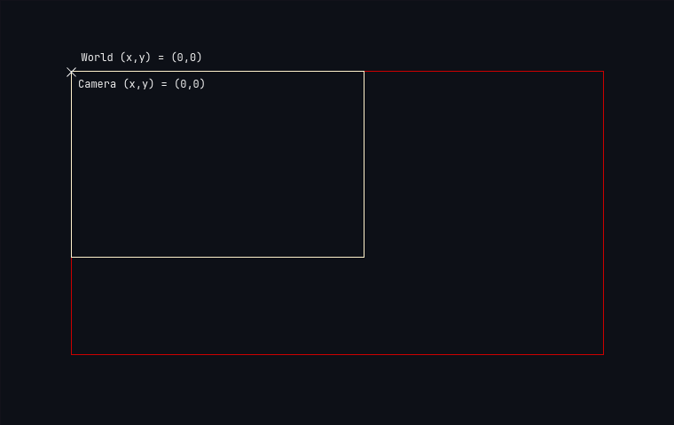

# Introduction

A camera is an important part of most games. A good camera often affects how the 
player experiences the game. This record goes over how to create a good camera 
in the LÖVE framework. If you are reading this, having a basic understanding of
programming and lua is recommended.

# Understanding How Cameras Work In Games

Before we set up our basic camera, we need to understand how a gamera works in
games. At a first glance, it might seem that the camera is moving around the
world, but it isn't really so. The camera really doesn't exist. It is just what 
we see in our screen that is changing. So the camera is really the window of our
game and it does not move at all - it is static. So how does what we see on the
screen change? If we can't move the camera, we simply have to move the game world!

Let us visualize what moving the game world really means. Say the world is
located at (x, y) = (0, 0). These are the coordinates of the `world_origin`.
Initially, let us have our `camera_location` also located at this position.



The viewport of our screen (or our camera) is fixed. The question is, how exactly
do we move the world to give the illusion that the camera is moving?

# Setting Up a Basic Camera

To set up a basic camera in LÖVE,
