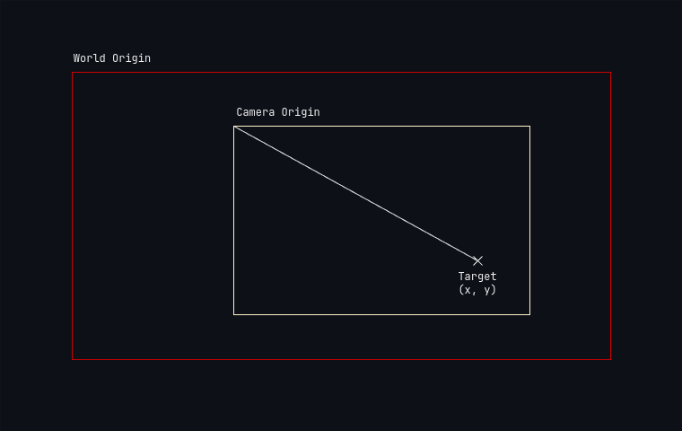
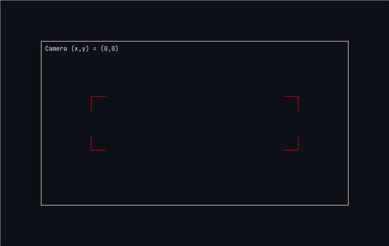

# Introduction

A camera is an important part of most games. A good camera often affects how the
player experiences the game. This record goes over how to create a good camera
in the LÖVE framework. If you are reading this, having a basic understanding of
programming and lua is recommended.

## Understanding How Cameras Work In Games

Before we set up our basic camera, we need to understand how a camera works in
games. At a first glance, it might seem that the camera is moving around the
world, but it isn't really so. The camera really doesn't exist. It is just what
we see in our screen that is changing. So the camera is really the window of our
game and it does not move at all - it is static. So how does what we see on the
screen change? If we can't move the camera, we simply have to move the game world!

Let us visualize what moving the game world really means. Say the world is
located at (x, y) = (0, 0). These are the coordinates of the origin of the world.
Initially, let us have our camera also located at this position.


The viewport of our screen (or our camera) is fixed. The question is, how exactly
do we move the world to give the illusion that the camera is moving? We can
move the world in two directions:
1. In the direction that the camera wants to move to view the target.
2. Opposite to the direction that the camera wants to move to view the target.

If we move the world in the direction that we want the camera to move (the target),
we end up going away from the target. This is illustrated in the
image below.


If we move the world in the opposite direction that we want the camera to move,
we end up going towards the target.


Now that we know how to move the World around, we can start building our
camera.

## Setting Up a Basic Camera

Let's set up a simple rectangle in our LÖVE game that will act as the target.

```lua {title="main.lua"}
local love = require("love")

function love.load()
  player = {
    x = 100,
    y = 100,
    speed = 100
  }
end

function love.update(dt)
  if love.keyboard.isDown("left") then
    player.x = player.x - (player.speed * dt)
  elseif love.keyboard.isDown("right") then
    player.x = player.x + (player.speed * dt)
  end

  if love.keyboard.isDown("up") then
    player.y = player.y - (player.speed * dt)
  elseif love.keyboard.isDown("down") then
    player.y = player.y + (player.speed * dt)
  end
end

function love.draw()
  love.graphics.rectangle("fill", player.x, player.y, 30, 30)
end
```

If you run this program using the following command from the root directory of your
project, you will see a white rectangle in your screen that you can move around
using the arrow keys.

```bash
love .
```

If you, however, go out of the screen area, you lose sight of the rectangle. To
make sure that doesn't happen, we will setup a camera.

To keep track of how much the world needs to moved in the x and y coordinates,
we will create a Camera table that has two fields storing said x and y values.

```lua {title="The Camera table"}
local Camera = {
    x = 0,
    y = 0,
}
```

Assuming that we want the target to be in the center of the camera at all times,
we can calculate the distance of the target from the camera center and use that
to move the world.


The units of x (or pixels) the world needs to be moved to get the target in the
center are
\[ x = x_t - cameraWidth/2 \]
\[ y = y_t - cameraHeight/2 \]

<a id="figure-5"></a>


If the Camera's width and height are the same as that of the screen, we can
get those values in our `update` loop as follows:

```lua {title="Updating the Camera's x and y values"}
function love.update(dt)
  ...
  Camera.x = player.x - love.graphics.getPixelWidth()/2
  Camera.y = player.y - love.graphics.getPixelHeight()/2
end
```

Now we need to move the World by some the x and y values stored in the Camera
table during the `draw` loop.

```lua {title="Drawing the World with an offset from the Camera"}
function love.draw()
  love.graphics.push()
  love.graphics.translate(-Camera.x, -Camera.y)
  love.graphics.rectangel("fill", player.x, player.y, 30, 30)
  love.graphics.pop()
end
```

Let us have a look at each line of code in the `draw` loop.

Firstly, we have `love.graphics.push()` in the first line. This is a function
provided by LÖVE that pushes all the currently applied transformation to the
stack. This is necessary to make sure that any other transformations being
applied do not interfere with what we are going to draw next.

Next up is `love.graphics.translate(-Camera.x, -Camera.y)`. This translates
whatever we draw after this line by `-Camera.x` and `-Camera.y`.

Now we draw our player. And then pop the transformations we pushed to the stack
using `love.graphics.pop()` making sure the previous transformations are applied
again.

If we run this code now, we see that the target does not move at all when
we use our arrow keys. But what is really happening is that the target is now
set to always be in the center of the Camera. And since the Camera's width and
height were set to be equal to the screen, the screen center is now the Camera
center.

We can make a box to indicate our world boundaries to see if the camera is
indeed moving.

```lua {title="Adding World boundaries"}
function love.draw()
  love.graphics.push()
  love.graphics.translate(-Camera.x, -Camera.y)
  love.graphics.rectangle(
    "line",
    0,
    0,
    love.graphics.getPixelWidth(),
    love.graphics.getPixelHeight()
  )
  love.graphics.rectangle("fill", player.x, player.y, 30, 30)
  love.graphics.pop()
end
```

Now when we run the code, we can see that the target stays in the center of the
Camera and is actually moving around the World (or rather the World is moving
to keep the target in the center of the Camera)!

--TODO: Add gif here.

We now have our basic Camera setup!

## Reorganizing Code to Make a Library

If we want to make our Camera more modular, we will have to move it to a new
folder and create a library. I personally prefer doing this to keep the main
game loop clean and easy to read.

First we move the Camera table to a new file `camera/init.lua`. Once that is
done, we need to create a few helper methods.

```lua {title="The Camera library"}
local love = require("love")

local Camera = { }
Camera.__index = Camera

function Camera:new()
  local o = setmetatable({}, Camera)
  o._x = 0
  o._y = 0
  o.width = love.graphics.getPixelWidth()
  o.height = love.graphics.getPixelHeight()
  o.target = nil
  return o
end

function Camera:attach(target)
  self.target = target
end

function Camera:update()
  self._x = self.target.x - self.width/2
  self._y = self.target.y - self.height/2
end

function Camera:set()
  love.graphics.push()
  love.graphics.translate(-self._x, -self._y)
end

function Camera:unset()
  love.graphics.pop()
end

return Camera
```

Camera is now a class which has a few fields and methods. You could choose not
to create a class but I prefer to and so I've made it into one.

We create a new Camera instance by using the `Camera:new()` method.
`Camera.target` now holds a reference to the target that we want to track, and the
target has to be manually attached once.

The `Camera:update()` method has the logic for calculating the distance to
move the world to get the target in the center.

`Camera:set()` and `Camera:unset()` can now be used to apply transforms, draw
our sprites, and then unset the transformations.

We can further improve this by utilizing LÖVE's `Transform` to keep track of
all the translations, rotations, and scaling that we want to apply to the
World.

```lua {title="Using Transform to keep track of applied transformations"}
function Camera:new()
  local o = setmetatable({}, Camera)
  ... o.transform = love.math.newTransform()
  return o
end

function Camera:update()
  self._x = self.target.x - self.width/2
  self._y = self.target.y - self.height/2

  self.transform:translate(-self._x, -self._y)
end

function Camera:set()
  love.graphics.push()
  love.graphics.applyTransform(self.transform)
end

function Camera:unset()
  self.transform:reset()
  love.graphics.pop()
end
```

## Camera Bounds

Many a times we have a Camera that we want to set bounds on, i.e. we do not
want to expose the empty space around the World. We can see this situation in
[Figure 5](#figure-5) where the Camera shows the space outside our World. This
is a simple fix. We just need to know the bounds of the World and use these
to create guards when updating our Camera's `self._x` and `self._y` fields.

```lua {title="Bounding the Camera to the World boundary"}
function Camera:new()
  ...
  o.bounds = {
    set = false,
    top_x = nil,            --The left most x coordinate of the World
    top_y = nil,            --The left most y coordinate of the World
    bottom_x = nil,         --The right most x coordinate of the World
    bottom_y = nil          --The right most y coordinate of the World
  }
end

function Camera:setBounds(x, y, width, height)
  self.bounds.set = true
  self.bounds.top_x = x
  self.bounds.top_y = y
  self.bounds.bottom_x = x + width
  self.bounds.bottom_y = y + height
end
```

With this, we have the foundation for bounding the Camera to the World boundary.
Next, we need to modify the update function so that the new values of `self._x`
and `self._y` do not exceed the boundaries.

```lua {title="Modified update function"}
function Camera:update()
  local x = self.target.x - self.width / 2
  local y = self.target.y - self.height / 2

  if self.bounds.set then
    x = math.max(self.bounds.top_x, math.min(x, self.bounds.bottom_x - self.width))
    y = math.max(self.bounds.top_y, math.min(y, self.bounds.bottom_y - self.height))
  end

  self._x = x
  self._y = y

  self.transform:translate(-self._x, -self._y)
end
```

Lines 7 and 8 in this snippet utilize math functions to clamp the value of `x`.
We want the top-left part of the Camera to not go any lower than the top
x and y of the `bounds` and stay lower than bottom x and y. This does mean that
the target does not remain centered in the four corners. This might be a
desirable feature for your game, and if it isn't, you can simply have `bounds.set`
to `false`.

-- TODO: add gif (set boundary to ±100 in all directions)

## World to Camera Coordinates

Before we go ahead, it would become much more easier for us if we are able to
convert the coordinates from World space to Camera space. This means that we
convert the coordinates that use the World origin as their origin to coordinates
that use the Camera origin as their origin.




Doing this is simple enough if we have no rotations or scaling applied to the
Camera. We simply subtract the coordinates stored in `Camera._x` and `Camera._y`
from the World space coordinates.

```lua {title="World Space to Camera Space (NO Scaling or Rotation)"}
function worldToCamera(x, y)
  local camera_x = x - self._x
  local camera_y = y - self._y
  return camera_x, camera_y
end
```

But if we want to use scaling as well as rotation, it becomes a bit more complex.

Let the coordinates of the target be \((x_W, y_W)\) in the World space. To
find the coordinates of the target in Camera space, we need to apply some
transformations.

\[
\begin{bmatrix}
   s_{x} \cdot cos(\theta) & -s_{x} \cdot sin(\theta) & x_{cam} \cdot cos(\theta) + y_{cam} \cdot sin(\theta) \\
   s_{y} \cdot cos(\theta) & -s_{y} \cdot sin(\theta) & x_{cam} \cdot cos(\theta) - y_{cam} \cdot sin(\theta) \\
   0 & 0 & 1
\end{bmatrix}
\]

Where \((x_{cam}, y_{cam})\) are the coordinates of the Camera origin location.
Because our Camera origin is fixed and does not move, the values of \(x_{cam}\)
and \(y_{cam}\) are both 0. So the transformation matrix becomes

\[
\begin{bmatrix}
   s_{x} \cdot cos(\theta) & -s_{x} \cdot sin(\theta) & 0 \\
   s_{y} \cdot cos(\theta) & -s_{y} \cdot sin(\theta) & 0 \\
   0 & 0 & 1
\end{bmatrix}
\]

## Camera to World Coordinates

## Camera Zoom

## Camera Rotation

## Implementing Damping

Damping, simply put, is the smooth movement of the camera instead of jerky motions.
In physics, damping is the loss of energy of an oscillating system. Here, we
will initially model it as a linear system, but also take a look at oscillating
systems later.

### Linear Interpolation

To dampen our camera movement each update, we can use the calculated difference
between the target and the camera center, subtract the camera position to get the
delta (the distance between the target and the camera center), multiply it with
a damping factor, and then add it to our current camera coordinates.

\[x = x + ( (x_t - cameraWidth/2) - x ) * dampingFactor\]
\[y = y + ( (y_t - cameraHeight/2) - y ) * dampingFactor\]

This is similar to the equation for Linear Interpolation:

\[y = x + (a - x) * b \]
where \(b\) is the interpolation factor, \(a\) is the destination, and \(x\)
and \(y\) are the current position and new position respectively.

Here is the updated code for the `Camera:update()` function to utilize this
interpolation.

```lua {title="Linear Interpolation Damping"}
function Camera:new()
  ...
  o.damping = 0.1
  return o
end

function Camera:update()
  self._x = self._x + ( (self.target.x - self.width/2) - self._x ) * self.damping
  self._y = self._y + ( (self.target.y - self.height/2) - self._y ) * self.damping
end
```

The closer the value of `damping` is to 1, the faster the camera
moves, and subsequently, the farther away the value is from 1, the slower it
moves. You can change the value of the damping factor to try out what feels
good for your game.

This current setup however, is not frame-independent, which means that on a
machine with a faster frame rate, the camera will reach its destination faster.
To make the damping equation factor this in, we can use delta time (`dt`) which
is the time passed between two consecutive frames.

Multiplying this along with the damping factor makes our update function
frame-independent. At higher frame rates, `dt` is smaller and so is the product
of `damping` and `dt`, and lower frame rates `dt` is larger, which keeps the
damping consistent over time.


As a consequence of this multiplication, we need to increase the value of
`damping` to make sure that the product does not become too small.

```lua {title="Linear Interpolation Damping (Frame-Rate Independent)"}
function Camera:new()
  ...
  o.damping = 4
  return o
end

function Camera:update(dt)
  self._x = self._x + ( (self.target.x - self.width/2) - self._x ) * self.damping * dt
  self._y = self._y + ( (self.target.y - self.height/2) - self._y ) * self.damping * dt
end
```

Of course, you can go further and have different damping values for both the axes
if you feel like it!

--TODO: Add gif here.

What we just implemented was damping using *Linear Interpolation*, more commonly
known as *lerp*. There are many more ways you can rig the camera to dampen
movement. Let's have a look at some more of them.

### Exponential Decay Damping

In this approach, the camera initially moves at higher speeds and then slows
down exponentially as it reaches the target location. It is similar to lerp,
but instead of multiplying directly by damping, we multiply the delta by
a negative exponent of damping subtracted from 1.

\[ y = x + (b - x) * (1 - e^{-x}) \]

")

To make this frame-independent, we multiply `damping` by `dt`.

```lua {title="Exponential Decay Damping (Frame-Rate Independent)"}
function Camera:update(dt)
  self._x = self._x + ( (self.target.x - self.width/2) - self._x ) * (1 - math.exp(self.damping * dt))
  self._y = self._y + ( (self.target.y - self.height/2) - self._y ) * (1 - math.exp(self.damping * dt))
end
```

We have a couple of problems here though.

1. First up, as the distance gets smaller, the steps we take to reach the target
become infinitesimally small, so small that the camera motion may appear to be
jerky between steps.

2. Secondly, unless the delta reaches exactly zero, which is unlikely, the calculation
will go on forever even if we stop moving our character, at times crossing zero
and becoming negative.

To fix this, we can set a threshold that enforces a limit on how small the
steps can be.

```lua {title="Threshold-Capped Exponential Decay Damping (Frame-Rate Independent)"}
function Camera:new()
  ...
  o.damping = 4
  o.damping_threshold= 5
  return o
end

function Camera:update(dt)
  local x = self.target.x - self.width/2
  local y = self.target.y - self.height/2

  local delta_x = x - self._x
  local delta_y = y - self._y

  local factor = 1 - math.exp(-self.damping * dt)

  if (delta_x * factor) < self.damping_threshold then
    self._x = x
  else
    self._x = self._x + delta_x * factor
  end

  if (delta_y * factor) < self.damping_threshold then
    self._y = y
  else
    self._y = self._y + delta_y * factor
  end
end
```

--TODO: Add gif here.

With these improvements, we avoid unnecessary calculation and increase performance.
You can change the curve of damping by tweaking the factor to get the desired
smoothness.

### Under Damped Spring System

We've all seen springs and how they oscillate when a force is applied. We use
that as the basis here and treat any camera movement as a spring. The actual
equation the movement of the spring in an ideal system is as follows:

\[ p = Acos(\omega t) \]

where \(p\) is the position of the spring, \(A\) is the amplitude, \(\omega\) is the
angular frequency, and \(t\) is time.

Note that this is for an ideal system and would not end up slowing down over
time. It does not account for the damping and velocity, which is something
we need to create the smooth camera motion that we are looking for.

To fix this, the equation needs to be modified. Without going into the details
and turning this into a Physics class, the new equations would be:

\[ v = v + \left(\frac{-k * (x-x_{target}) - c * v}{m}\right) * t \]

where \(v\) is the velocity, \(k\) is the stiffness, \(x\) is the current position,
\(c\) is the damping factor, \(m\) is the mass and \(t\) is the time. For
simplicity, we can take the mass to be 1.

We then use this velocity to calculate the new value of \(x\).

\[ x = x + v * t \]

")

In each time frame, we reduce the velocity slightly using the damping factor,
eventually making the value of \(x\) reach \(x_{target}\). If we remove the
reduction of velocity because of the damping factor, the camera will keep on
oscillating and never come to a stop. You can try this out by setting the
damping factor to zero in the code below.

The issue we experienced with exponential decay is also present here, so we
need to cap the values to prevent calculations when the positional difference
is infinitesimally small.

```lua {title="Under Damped Spring System (Frame-Rate Independent)"}
function Camera:new()
  o.velocityX = 0 -- Initialize velocity for X
  o.velocityY = 0 -- Initialize velocity for Y
  o.threshold = 0.01 -- Threshold to prevent infinite calculations
  o.stiffness = 10 -- Spring stiffness (k)
  o.mass = 1 -- Mass of the spring (m)
  o.damping = 2 -- Damping coefficient (c)
end

function Camera:update(dt)
  local x = self.target.x - self.width / 2
  local y = self.target.y - self.height / 2

  local delta_x = self._x - x
  local delta_y = self._y - y

  if math.abs(delta_x) > self.threshold then
    -- Spring-damping update for X-axis
    local force_x = -self.stiffness * delta_x
    local damping_x = -self.damping * self.velocity_x
    self.velocity_x = self.velocity_x + ((force_x + damping_x)/self.mass) * dt
    self._x = self._x + self.velocity_x * dt
  else
    self._x = x
    self.velocity_x = 0
  end

  if math.abs(delta_x) > self.threshold then
    -- Spring-damping update for Y-axis
    local force_y = -self.stiffness * delta_y
    local damping_y = -self.damping * self.velocity_y
    self.velocity_y = self.velocity_y + ((force_y + damping_y)/self.mass) * dt
    self._y = self._y + self.velocity_y * dt
  else
    self._y = y
    self.velocity_y = 0
  end
end
```

--TODO: Add gif here.

You can play with the spring stiffness and the damping factor to get the result
you desire. For the same `damping`, the higher the `stiffness`, the more
oscillations take place. For the same `stiffness`, the higher the `damping`,
the more the loss in force per oscillation. If you want more control over the
camera movement, you can increase the `mass` to get slower oscillations and
decrease it to get faster oscillations. Keep in mind that `mass` won't change
the number of oscillations or how much energy is lost in each oscillation.

### Critically Damped Spring System

A critically damped spring has a specific damping coefficient which makes it
reach the target as soon as possible without oscillating. The value of the
damping coefficient has to conform to the following equation to achieve this.

\[ c = 2 * \sqrt{ k * m } \]

")

Therefore, the only change that we need to make to simulate this behavior is:

```lua {title="Critically Damped Spring System (Frame-Rate Independent)"}
function Camera:new()
  o.velocityX = 0 -- Initialize velocity for X
  o.velocityY = 0 -- Initialize velocity for Y
  o.threshold = 0.01 -- Threshold to prevent infinite calculations
  o.stiffness = 10 -- Spring stiffness (k)
  o.mass = 1 -- Mass of the spring (m)
  o.damping = 2 * math.sqrt(o.stiffness * o.mass)-- Damping coefficient (c)
end
```

With this small change, we can make the camera stop at the target without
oscillations!

--TODO: Add gif here.

### SmoothDamp

Smooth Damp is an interpolation method that is used frequently in game dev,
particularly for smoothly stepping over positions or rotations over time. It
is similar to the Critically Damped Spring system but is implemented with
different equations. Below is the code from
[Unity's CS Reference](https://github.com/Unity-Technologies/UnityCsReference/blob/61f92bd79ae862c4465d35270f9d1d57befd1761/Runtime/Export/Math/Mathf.cs#L303)
in lua.

```lua {title="Unity's Smooth Damp Function"}
local function smoothDamp(current, target, velocity, smoothTime, maxSpeed, deltaTime)
  -- Ensure smoothTime is not too small
  smoothTime = math.max(0.0001, smoothTime)
  local omega = 2.0 / smoothTime

  -- Calculate the exponential decay factor
  local x = omega * deltaTime
  local exp = 1.0 / (1.0 + x + 0.48 * x ^ 2 + 0.235 * x ^ 3)

  -- Calculate the difference between current and target
  local change = current - target
  local originalTo = target

  -- Clamp the maximum speed (maxChange)
  local maxChange = maxSpeed * smoothTime
  change = math.max(-maxChange, math.min(change, maxChange))

  -- Update target based on the clamped change
  target = current - change

  -- Calculate the new velocity
  local temp = (velocity + omega * change) * deltaTime
  velocity = (velocity - omega * temp) * exp

  -- Calculate the new position
  local output = target + (change + temp) * exp

  -- Prevent overshooting the target
  if (originalTo - current > 0) == (output > originalTo) then
    output = originalTo
    velocity = (output - originalTo) / deltaTime
  end

  return output, velocity
end
```

We see here that is follows the same idea of modifying the velocity and using
it to update the position of the camera. The target in our case would
be `self.target.x - self.width/2` and `self.target.y - self.height/2`.

```lua {title="Smooth Damp Update Call"}
function Camera:update(dt)
  self._x, self.velocity_x = smoothDamp(
    self._x,
    self.target.x - self.width / 2,
    self.velocity_x,
    0.3,
    75,
    dt
  )
  self._y, self.velocity_y = smoothDamp(
    self._y,
    self.target.x - self.height / 2,
    self.velocity_y,
    0.3,
    50,
    dt
  )
end
```

The Smooth Damp interpolation method provides us with good control over the
camera movement without having to configure a lot of parameters and dealing
with the physics of things.

-- TODO: Add gif here

With this, you are well equipped to get a smoothly moving camera! Now we move
onto the next part of a good game camera, the Deadzones.

## Screen Shake
## Deadzones

Deadzones are, simply put, regions in which the target can move without the
camera moving to track it. Why are deadzones necessary? If you have the camera
tracking a target, readjusting the position at every small movement of the target
can become annoying, sometimes even nauseating or disorienting. This can be
avoided by implementing deadzones.



To implement a deadzone, we need to know what area of the camera the target
is free to roam in. Having the ability to turn the deadzone on and off makes
the camera more robust, so lets add a field to keep track of that.

```lua {title="Deadzone Table for the Camera"}
function Camera:new()
  ...
  o.deadzone = {
    enable = false,
    x = nil,
    y = nil,
    w = nil,
    h = nil,
  }
end
```

With this, we can now check if the target is in the deadzone or not and update
the world translation accordingly.

```lua {title="Guard for World translation update"}
function Camera:update(dt)
end
```

## Look-ahead

## Camera for non-target scenarios
